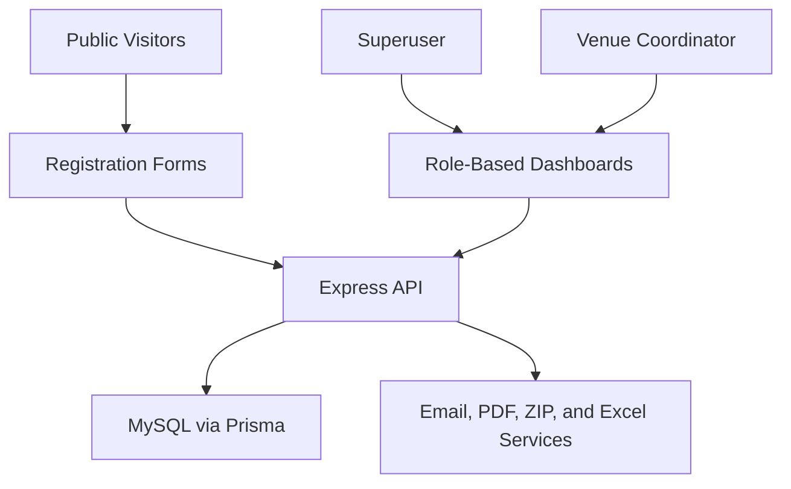

<p align="center">
  
</p>

**Patrones Hermosos** is a full-stack web platform that centralizes registration, venue coordination, group organization, application review, user management, operational analytics, audit records, and diploma generation for the Patrones Hermosos event.

The project was developed for **Patrones Hermosos** to replace fragmented administrative processes with a unified system for applicants, venue coordinators, and organization-wide administrators.

> [!NOTE]
> This repository is a public portfolio case study. The source code, database, internal documentation, configuration files, client data, and proprietary assets remain private because the original software was developed for a client.

---

## Overview

Patrones Hermosos supports the event lifecycle through three connected areas:

- **Public registration** for venues, participants, and collaborators.
- **Event administration** through role-specific dashboards for superusers and venue coordinators.
- **Operational delivery** through groups, status workflows, notifications, analytics, audits, exports, and diplomas.

The private application combines a Next.js interface, an Express API, a MySQL relational database managed through Prisma, and supporting services for email, PDF, ZIP, and spreadsheet generation.

> [!IMPORTANT]
> This public repository documents the product and its engineering concepts. It is not a deployable distribution of the client system and does not provide access to its source code or data.

---

## Preview


---

## Source Code Access

<p align="center">
  <a href="mailto:rock.gule@gmail.com?subject=Patrones%20Hermosos%20Repository%20Access%20Request">
    
  </a>
</p>

<p align="center">
  Send an access request to <a href="mailto:rock.gule@gmail.com?subject=Patrones%20Hermosos%20Repository%20Access%20Request">rock.gule@gmail.com</a> for professional review, recruitment, or an authorized technical evaluation.
</p>

> [!NOTE]
> Access requests are evaluated individually and may require authorization from Patrones Hermosos. Sending a request does not guarantee access or grant permission to copy, redistribute, or reuse the software.

---

## Project Goals

The project was created to:

- Centralize applications from prospective venues, participants, and collaborators.
- Give administrators a complete view of event operations across venues.
- Restrict venue coordinators to the information and actions relevant to their assigned venue.
- Organize participants, mentors, collaborators, schedules, and capacity through groups.
- Standardize approval, rejection, cancellation, and change-request workflows.
- Keep applicants and team members informed through transactional emails.
- Provide visual statistics for operational decision-making.
- Preserve an auditable record of important administrative changes.
- Generate personalized diplomas individually or in bulk.
- Export operational information for authorized backup and reporting tasks.

---

## Core Modules

| Module | Main Capabilities | Status |
|---|---|---|
| Public Registration | Venue, participant, and collaborator application forms with validation and file submission | Implemented |
| Authentication and Roles | JWT sessions, password hashing, logout invalidation, and superuser or venue-coordinator access | Implemented |
| Venue Administration | Venue review, coordinator assignment, status control, and venue-specific information | Implemented |
| Group Management | Capacity, language, level, modality, dates, schedules, mentors, and excluded days | Implemented |
| People Management | Participants, mentors, collaborators, staff, and coordination roles | Implemented |
| Application Workflow | Pending, approved, rejected, and cancelled states with email notifications | Implemented |
| Analytics and Audit | Role-scoped statistics, charts, tabular views, and administrative action logs | Implemented |
| Diplomas and Exports | Personalized PDF diplomas, bulk ZIP generation, email delivery, and Excel export | Implemented |
| Automated Validation | Jest, Testing Library, and Cypress test suites for key interfaces and workflows | Implemented |

---

## How It Works

The platform connects public registration flows with protected operational dashboards and a shared relational data model.



A typical workflow is:

```text
Submit an application
        ↓
Validate and store the information
        ↓
Review the request in an authorized dashboard
        ↓
Approve, reject, cancel, or request changes
        ↓
Assign the approved person to a venue, role, or group
        ↓
Notify the relevant user and record the operation
        ↓
Use the approved data for statistics, exports, and diplomas
```

---

## 1. Public Registration

The public experience provides separate application flows for the main event audiences.

| Registration Type | Captured Context |
|---|---|
| Venue | Institution, location, coordination information, logo, and participation documentation. |
| Participant | Personal, educational, tutor, preferred-group, and participation-file information. |
| Collaborator | Academic profile, preferred role, language, level, and group preferences. |

The forms include field validation, country and region selection, group availability, document handling, and clear success or error notifications.

> [!IMPORTANT]
> Registration information may contain personal data and uploaded documents. Any production deployment must provide appropriate privacy notices, consent mechanisms, retention rules, and authorized access controls.

---

## 2. Role-Based Administration

The private area adapts its navigation, data scope, and available actions to the authenticated role.

### Superuser

Superusers can work across the complete event structure, including:

- Organization-wide statistics.
- Venue applications and venue management.
- Venue coordinators and assistant coordinators.
- Mentors, participants, collaborators, and staff.
- Application review and status updates.
- Diploma generation and delivery.
- Audit-log consultation.
- Authorized database backup and administrative operations.

### Venue Coordinator

Venue coordinators receive a focused operational view that includes:

- Statistics for their assigned venue.
- Venue information and group management.
- Participants, mentors, collaborators, and staff associated with the venue.
- Venue-scoped applications and status decisions.
- Diploma management for eligible users.
- Audit records associated with their operational scope.

Authentication uses signed JWTs. Passwords are compared against hashed values, and logout increments a token version so previously issued sessions can be invalidated.

---

## 3. Venue and Group Management

Venues act as the primary organizational boundary for the event.

Each venue can be associated with:

- Venue and assistant coordinators.
- Mentors.
- Participants and collaborators.
- One or more operational groups.
- Venue-specific applications and audit records.

Groups define the structure used to place approved participants and collaborators.

| Group Property | Purpose |
|---|---|
| Capacity | Defines available and occupied places. |
| Language | Supports Spanish- or English-oriented groups. |
| Level | Distinguishes supported experience or learning levels. |
| Modality and Location | Describes how and where the group operates. |
| Date Range | Establishes the group's active period. |
| Schedule | Defines start and end times. |
| Mentor | Associates an approved mentor with the group. |
| Excluded Days | Records dates on which the group does not meet. |

The relational model keeps group assignments connected to their venue while allowing preferred-group selections to be reviewed before final placement.

---

## 4. Applications and Notifications

Applications move through explicit status transitions rather than being treated as simple form submissions.

Supported workflow concepts include:

- Pending review.
- Approval and assignment.
- Rejection with an administrative decision.
- Cancellation when a previously accepted record is no longer active.
- Change requests when submitted information must be corrected.
- Venue-specific filtering for coordinators.
- Administrative feedback through on-screen notifications.
- Transactional email templates for relevant status changes.

Email templates cover participants, collaborators, venues, mentors, coordinators, access recovery, and diploma delivery.

> [!NOTE]
> Email delivery depends on correctly configured credentials and an available mail provider. Delivery status should be monitored independently from the database workflow in a production environment.

---

## 5. Analytics and Audit Records

The analytics area converts operational records into visual summaries for administrators and coordinators.

It supports:

- Participant, collaborator, and administrative categories.
- Venue-based filtering.
- Role and status breakdowns.
- Bar, line, and pie visualizations.
- Configurable presentation options.
- Table-based alternatives to chart views.
- Reusable chart and legend components.

The audit module records important data changes with contextual information such as:

- Action type: insert, update, or delete.
- Affected data area.
- Associated venue when applicable.
- Responsible username.
- Human-readable operation message.
- Date and time of the event.

> [!IMPORTANT]
> Audit records support operational traceability, but they do not replace a formally certified compliance or security logging platform.

---

## 6. Diplomas, Backups, and Exports

The diploma module uses role-specific PDF templates and approved records to create personalized documents.

Diploma data can include:

- Recipient name.
- Venue or committee.
- Participant or team role.
- Group start and end dates.
- Recipient email.

Authorized users can generate diplomas for individual recipients, deliver them by email, or build a structured ZIP archive grouped by venue and role.

The administrative export workflow can also produce an Excel workbook containing operational tables and combine it with generated diplomas in a backup archive.

```text
Approved event records
        ↓
Select eligible recipients
        ↓
Fill the appropriate PDF template
        ↓
Generate individual files or a grouped ZIP archive
        ↓
Download, email, or include the output in an authorized backup
```

---

## Technology Stack

| Area | Technologies |
|---|---|
| Frontend | Next.js 15, React 19, TypeScript |
| Interface and Styling | Tailwind CSS, Framer Motion, Headless UI, Radix UI |
| Backend | Node.js, Express 5, REST APIs |
| Database | MySQL, Prisma ORM |
| Authentication | JSON Web Tokens, bcryptjs, role middleware, token-version invalidation |
| Validation | Express Validator, Zod, client-side form validation |
| Data Visualization | Recharts, D3 utilities, reusable bar, line, and pie components |
| Documents and Exports | PDF-Lib, PDFKit, ExcelJS, Archiver |
| Email | Nodemailer, EJS templates |
| File Handling | Multer, database-backed binary data, scheduled temporary-file cleanup |
| Testing | Jest, Testing Library, Cypress |
| Automation | Node Cron, Semantic Release, custom data and icon scripts |

---

## Conceptual Data Model

The private application organizes the event through the following high-level entities:

| Entity | Responsibility |
|---|---|
| Venue | Institution, location, documentation, operational status, and event relationships. |
| Venue Coordinator | Authenticated user responsible for an assigned venue. |
| Assistant Coordinator | Supporting coordination role associated with a venue. |
| Group | Capacity, language, level, modality, schedule, mentor, and venue assignment. |
| Participant | Applicant information, educational context, tutor, preferred group, and final assignment. |
| Collaborator | Applicant information, academic profile, preferred role, language, level, and group. |
| Mentor | Approved mentor associated with a venue and one or more groups. |
| Tutor | Adult contact associated with participant records when required. |
| Superuser | Organization-wide authenticated administrator. |
| Audit Record | Action type, data area, venue context, user, message, and timestamp. |

> [!NOTE]
> This is a high-level conceptual description. Executable schemas, migrations, seed data, stored records, credentials, and infrastructure identifiers are intentionally excluded.

---

## Key Technical Decisions

- **Unified full-stack project:** Next.js and Express run within one Node.js application while maintaining separate interface and API responsibilities.
- **Relational event model:** Prisma and MySQL preserve relationships among venues, groups, roles, applicants, assignments, and audit records.
- **Role-scoped administration:** superusers receive organization-wide capabilities while venue coordinators operate within their assigned venue.
- **Explicit status workflows:** applications and operational records use controlled lifecycle states instead of implicit approval logic.
- **Reusable interface system:** shared inputs, dropdowns, tables, menus, notifications, charts, and icons reduce duplication across dashboards.
- **Template-based communication:** EJS email templates and role-specific diploma templates keep outbound communication consistent.
- **Bulk document generation:** PDF creation and ZIP streaming support event-scale diploma delivery.
- **Automated cleanup:** scheduled maintenance removes temporary uploaded files after their configured retention window.

---

## Reliability and Fallback Behavior

| Situation | System Behavior |
|---|---|
| Missing or invalid session token | Protected requests are rejected and the user must authenticate again. |
| Revoked session | A token-version mismatch prevents reuse of a token invalidated during logout. |
| Unauthorized role | Role middleware blocks access to operations outside the user's authorization. |
| Venue coordinator request | Operational data is filtered to the coordinator's assigned venue where the workflow requires it. |
| Invalid form or API input | Validation errors are returned before the requested operation is completed. |
| Temporary upload exceeds retention period | Scheduled cleanup removes stale temporary files. |
| One bulk diploma cannot be generated | The bulk process can continue with other eligible recipients and report the failed document. |
| No eligible diplomas are produced | The resulting archive includes an explanatory file instead of silently returning an empty package. |

---

## Privacy and Security

The project applies security and privacy controls across authentication, authorization, and data handling:

- Passwords are stored as hashes rather than plain text.
- JWTs carry the authenticated identity and supported role.
- Token-version checks allow active sessions to be invalidated.
- Role middleware protects privileged operations.
- Venue coordinators receive scoped operational views.
- Input validators reject malformed registration and authentication data.
- Temporary uploads are removed through scheduled cleanup.
- Production credentials are expected through environment variables.
- Client records, uploads, and database contents are excluded from the public case study.

> [!WARNING]
> Production deployments must use a strong environment-specific JWT secret, secure email credentials, HTTPS, least-privilege database accounts, protected backups, complete authorization coverage, and an approved personal-data retention policy.

---

## Public Repository Scope

This repository is intentionally documentation-only.

It does not contain:

- Application source code or compiled builds.
- Database schemas, migrations, seed files, or stored records.
- Participant, collaborator, mentor, coordinator, or venue data.
- Uploaded documents, profile images, or temporary files.
- Credentials, tokens, environment files, or provider configuration.
- Internal requirements, test evidence, or operational documentation.
- Proprietary logos, screenshots, diploma templates, PDFs, illustrations, or client assets.

> [!IMPORTANT]
> Installation, build, and execution instructions are intentionally omitted because the original software is private and is not distributed through this repository.

Authorized reviewers may request access by emailing [rock.gule@gmail.com](mailto:rock.gule@gmail.com?subject=Patrones%20Hermosos%20Repository%20Access%20Request).

---

## Project Status

The documented private release is version **4.1.0** and includes the main registration, administration, venue, group, user, application, analytics, audit, diploma, notification, and export workflows.

The repository also contains automated interface and workflow validation using Jest, Testing Library, and Cypress. These tests cover representative areas such as public forms, statistics, requests, user editing, audit management, and diploma administration.

Any current production deployment, client data, infrastructure configuration, or changes made after the documented delivery are outside the scope of this public case study.

---

## Technical Concepts Demonstrated

This project demonstrates:

- Full-stack TypeScript application development.
- Next.js App Router and reusable React interfaces.
- Custom Express API integration with a Next.js application.
- Relational modeling with Prisma and MySQL.
- Role-based authentication and authorization.
- Revocable JWT session design.
- Multi-step registration and validation workflows.
- File-upload and binary-document handling.
- Venue-scoped multi-tenant-style data access.
- Status-driven application management.
- Transactional email templating.
- PDF personalization and bulk ZIP generation.
- Excel data export.
- Operational dashboards and reusable charts.
- Audit logging and traceability.
- Unit, component, and end-to-end testing.
- Client-focused delivery and privacy-aware portfolio documentation.

---

## Possible Improvements

Future versions could include:

- Multi-factor authentication for administrative accounts.
- Short-lived access tokens with secure refresh-token rotation.
- Centralized authorization policies applied consistently to every protected endpoint.
- Rate limiting and hardened HTTP security headers across public and private routes.
- Object storage with malware scanning for uploaded documents.
- Background queues for email, diploma, and large export jobs.
- Delivery tracking and retry policies for transactional emails.
- Configurable audit-log retention and protected audit exports.
- Database backup encryption and restore verification.
- Expanded API integration and authorization tests.
- Continuous integration with automated quality and security checks.
- Accessibility testing for keyboard, screen-reader, and reduced-motion support.
- Additional localization and content-management options.
- Centralized monitoring, structured logs, and operational alerts.

---

## License

This case study is publicly available for portfolio review purposes only.

The original source code, database, schemas, migrations, documents, visual assets, email templates, diploma templates, screenshots, logos, client data, and other private project materials may not be used, copied, modified, redistributed, sublicensed, reverse engineered, or used commercially without explicit written permission from their respective owners.

No open-source license for the original software is granted through this repository.

All rights reserved to Patrones Hermosos and contributors unless otherwise stated.

> [!IMPORTANT]
> Third-party frameworks, libraries, services, and assets remain subject to their own licenses and terms.

---

## Disclaimer

This repository presents a technical and product-level overview of work completed for Patrones Hermosos. It is not an official operational portal, public distribution, or authorization to process event or applicant information.

Any deployment that handles personal information, uploaded documents, credentials, email communication, or administrative exports must be reviewed against the organization's current privacy, security, legal, and operational requirements.

> [!CAUTION]
> Do not use this case study as a substitute for access authorization, production documentation, security review, privacy assessment, or client approval.
